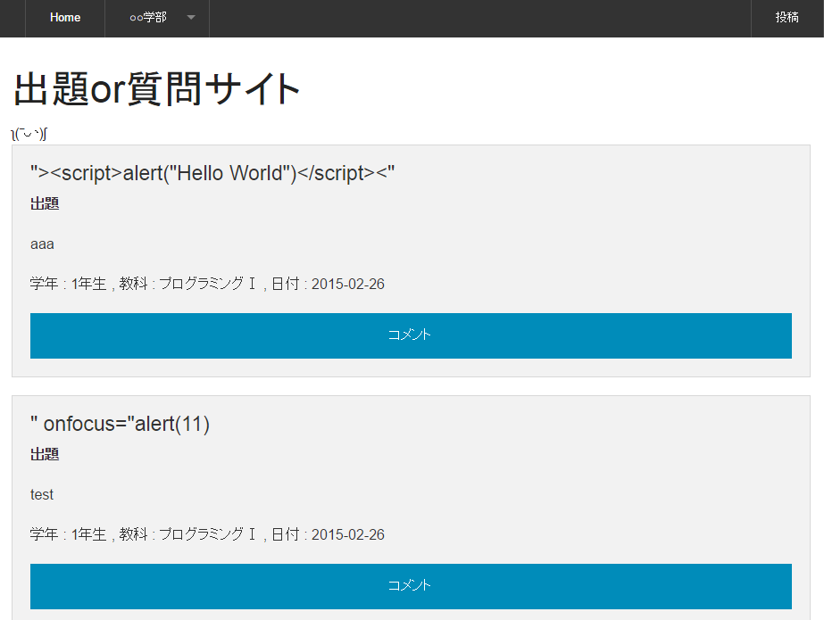
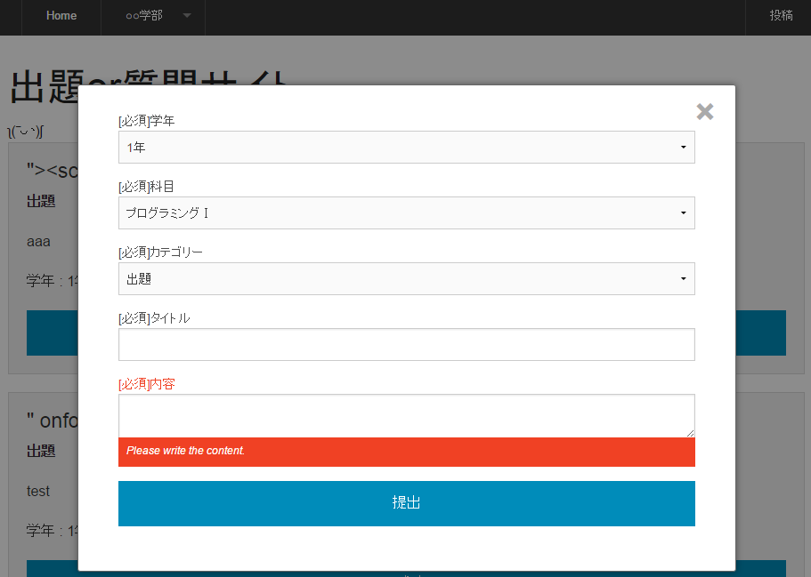
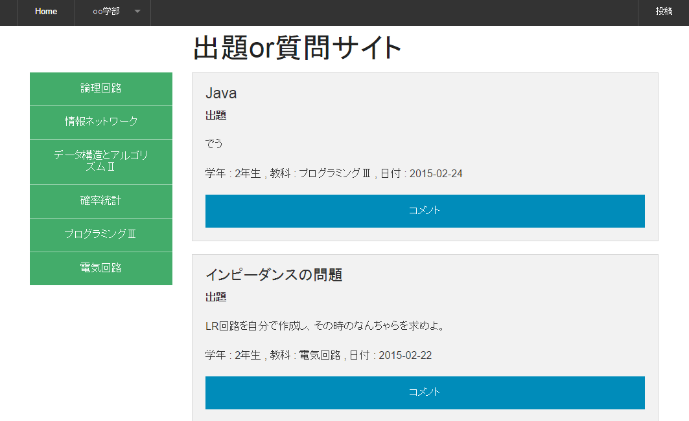
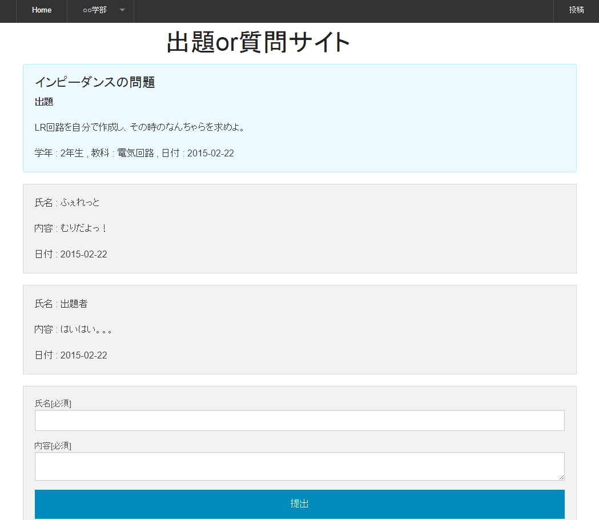

## 実行画面

ホーム画面

投稿画面

学年別画面

コメント画面

## 導入方法

    $ git clone https://github.com/ferretdayo/question-problem.git
    
    $ cd question-problem
    
    $ composer install

    $ php artisan serve

    $ http://localhost:8000のはず

あとMySQLを利用しており，info_bbs.sqlに構造が入っているので，importしてください．
